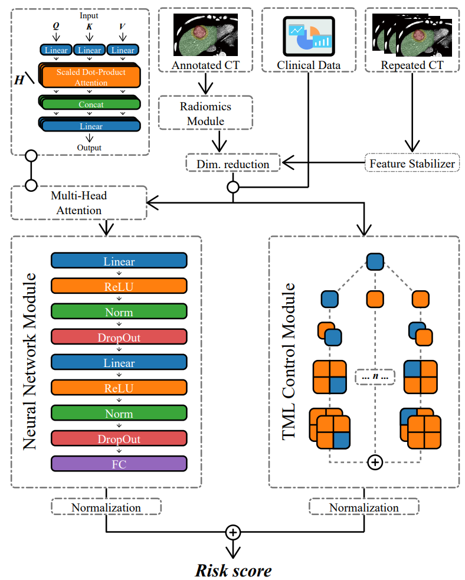
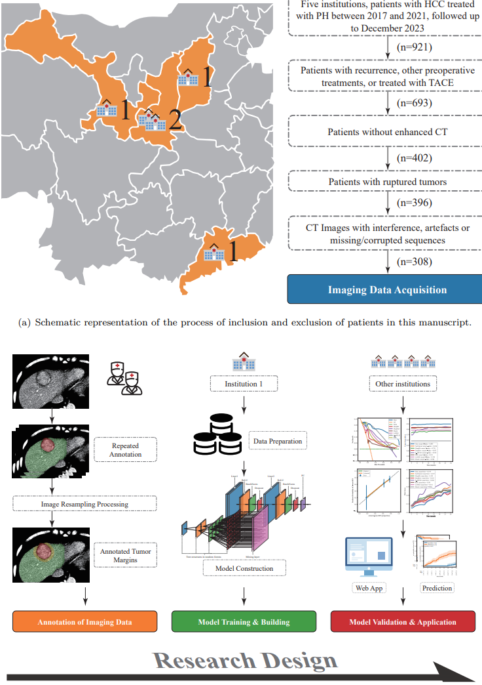
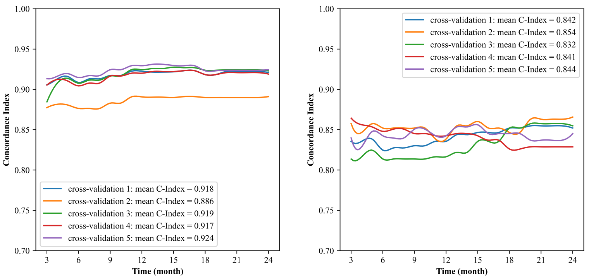

# DIDANet: An Attentive Neural Decision Framework
### [website](didanet.wistu.cn) 'https://didanet.wistu.cn'

#### We present a multimodal deep imaging decision attention network (DIDANet) that integrates radiomics with traditional ML modules and introduces them into a neural network. DIDANet effectively predicts ER and postoperative TACE benefits in HCC patients. Additionally, it addresses overfitting in small-sample medical models to some extent.

## Network Architecture


## Research Design


## Results in different centers

##  Usage
### Requirements
```
optuna  3.2.0
pycox  0.2.3
scikit-learn  1.2.2
torch  2.0.1
```
Please see ```requirements.txt``` for all the other requirements.
### Installation
Clone this repo:
```
git clone https://github.com/iWiley/DIDANet.git
```
### Setting up conda environment:
Create a virtual ```conda``` environment named ```Radiomics-CT-master``` with the following command:
```
conda create --name GDCD --file requirements.txt
conda activate Radiomics-CT-master
```

